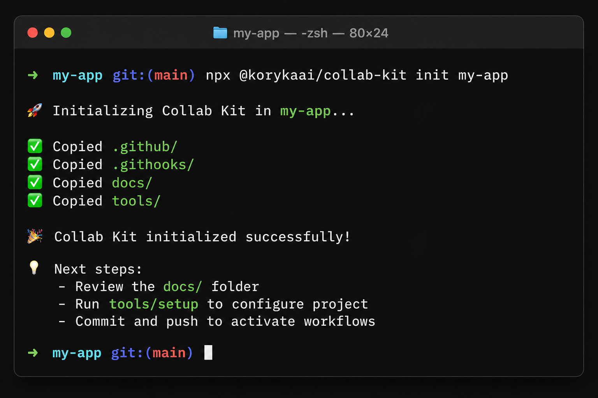

<p align="center">
  
</p>

<h1 align="center">Collab Kit</h1>

<p align="center">
  <strong>Bootstrap GitHub team workflows in one command.</strong><br>
  PR templates, issue templates, CI, git hooks, commit validators, and maintainer docs — copied into your repo so you stop reinventing the same scaffolding.
</p>

<p align="center">
  <a href="https://github.com/kory-kaai/collab-kit/actions/workflows/ci.yml"></a>
  <a href="https://www.npmjs.com/package/@korykaai/collab-kit"></a>
  <a href="LICENSE"></a>
  <a href="package.json"></a>
</p>

<p align="center">
  <a href="https://www.npmjs.com/package/@korykaai/collab-kit"><strong>npm</strong></a> ·
  <a href="#quick-start"><strong>Quick start</strong></a> ·
  <a href="#why-collab-kit"><strong>Why collab-kit?</strong></a> ·
  <a href="docs/onboarding.md"><strong>Docs</strong></a> ·
  <a href="CHANGELOG.md"><strong>Changelog</strong></a>
</p>

---

## See it in action

<p align="center">
  
</p>

```bash
npx @korykaai/collab-kit init my-app
```

**Before:** empty repo, no templates, no CI, no conventions.

**After:** a complete collaboration baseline you own and can customize.

```
my-app/
├── .github/          # PR + issue templates, CI, Dependabot
├── .githooks/        # commit message hygiene
├── docs/             # maintainer playbooks (PR workflow, triage, FAQ)
├── tools/            # commit + branch validators
├── CONTRIBUTING.md
├── CODE_OF_CONDUCT.md
└── SECURITY.md
```

## Quick start

Scaffold into your current repo:

```bash
npx @korykaai/collab-kit init .
git config core.hooksPath .githooks
```

Or into a new directory:

```bash
npx @korykaai/collab-kit init my-project
cd my-project
git init
git config core.hooksPath .githooks
```

Use `--force` to overwrite files that already exist.

## Why collab-kit?

| Approach | Setup time | You own the files | Includes docs + validators | Works offline |
|----------|:----------:|:-----------------:|:--------------------------:|:-------------:|
| **collab-kit** | ~30 sec | Yes | Yes | Yes |
| GitHub "Use this template" | ~2 min | Partial (new repo only) | Rarely | No |
| Husky + commitlint + manual templates | ~30 min | Yes | No | Yes |
| Copy-paste from an old repo | ~15 min | Yes | Maybe | Yes |

**collab-kit is for teams who want a batteries-included GitHub workflow baseline without adopting a framework or SaaS.**

- No account or API key required
- No framework lock-in — plain Markdown, YAML, and shell
- Opinionated defaults you can edit or delete
- Ships maintainer docs, not just config files

## What you get

| Category | Included |
|----------|----------|
| **GitHub** | PR template, bug/feature issue templates, Dependabot, CI workflow |
| **Git hooks** | `prepare-commit-msg` to strip unwanted co-author trailers |
| **Tooling** | Conventional Commits validator, branch name checker |
| **Docs** | PR workflow, issue triage, pair programming, onboarding, FAQ |
| **Community** | Code of conduct, contributing guide, security policy |

## CLI commands

```bash
collab-kit init [dir] [--force]              # copy workflow scaffold
collab-kit validate-commit "feat: add login" # check commit message
collab-kit branch-name feat/add-login        # check branch name
```

## Development

```bash
git clone https://github.com/kory-kaai/collab-kit.git
cd collab-kit
npm test
```

## Documentation

- [Onboarding checklist](docs/onboarding.md) — first steps after `init`
- [Pull request workflow](docs/pr-workflow.md)
- [Issue triage](docs/issue-triage.md)
- [Pair programming](docs/pair-programming.md)
- [Git attribution hook](docs/git-attribution.md)
- [npm CI setup](docs/npm-ci-setup.md)
- [Troubleshooting](docs/troubleshooting.md)

## Star history

If collab-kit saved you time setting up a repo, a star helps others find it.

[](https://github.com/kory-kaai/collab-kit)

## Contributing

PRs welcome! See [CONTRIBUTING.md](CONTRIBUTING.md).

## License

MIT — see [LICENSE](LICENSE).
